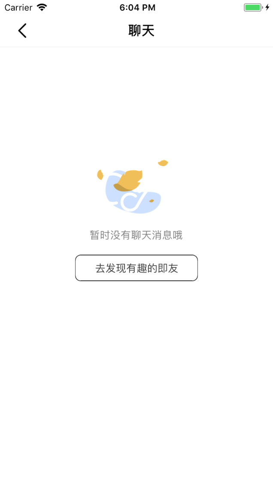
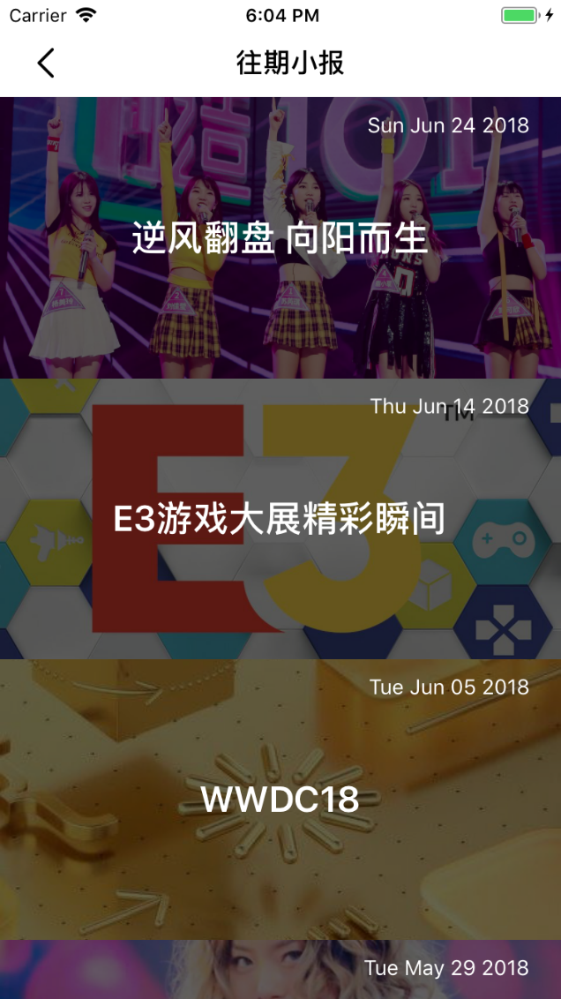

# 轻仿即刻

本项目中用到的Mock 数据来自 `easy-mock` 的服务，部分实时数据是从即刻官方API 中获取，Enjoy it ~

## 开发环境

* macOS High Sierra 10.13.4
* react-native-cli: 2.0.1
* react-native: 0.55.4

## 效果图

|  |  |  |
| ------------------------------------------------------------ | ------------------------------------------------------------ | ------------------------------------------------------------ |
|  |  |  |
|  |  |  |
|  |  |  |

## 联系我

本项目仅供学习交流，欢迎通过 `Github` 或者邮件与我联系！
